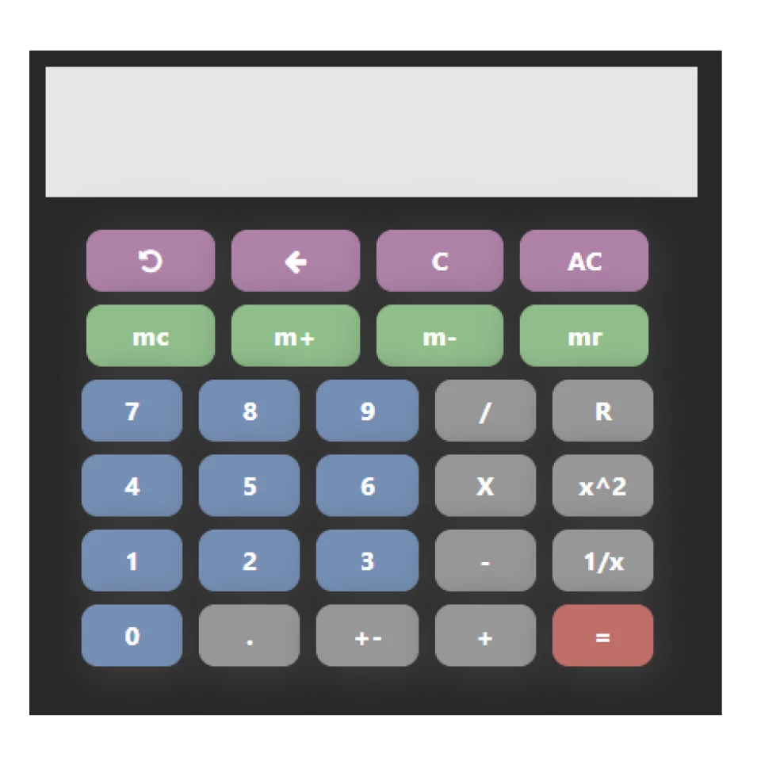
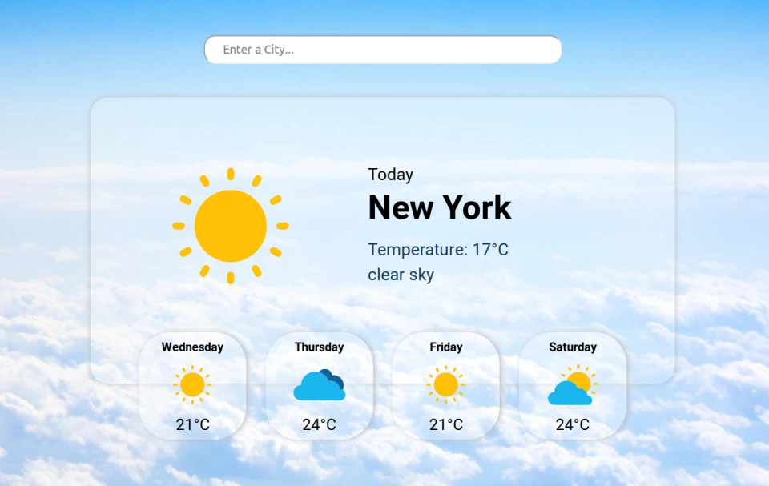
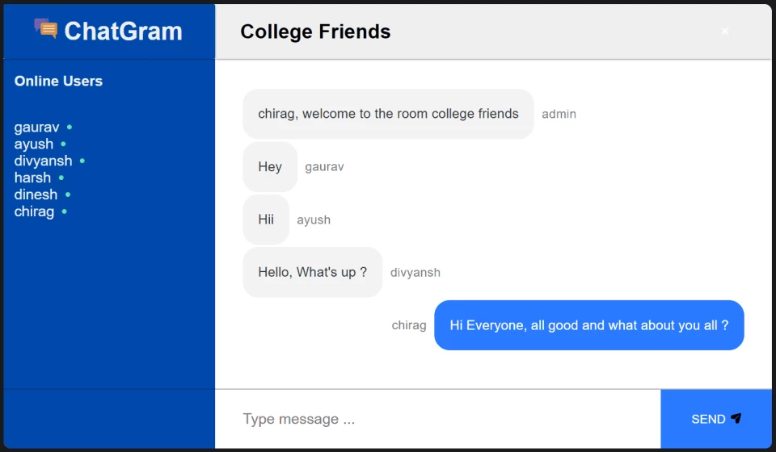
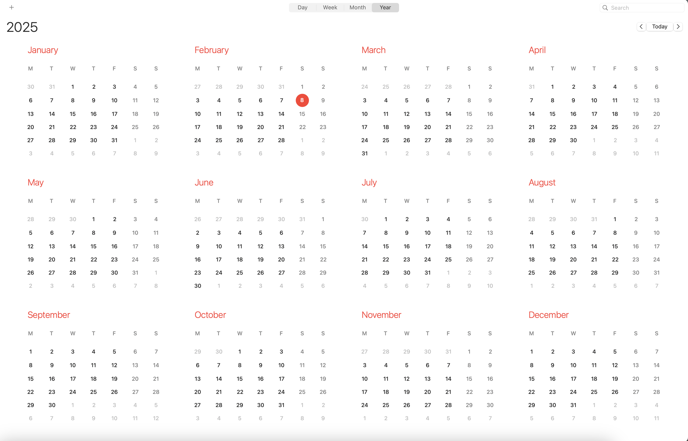
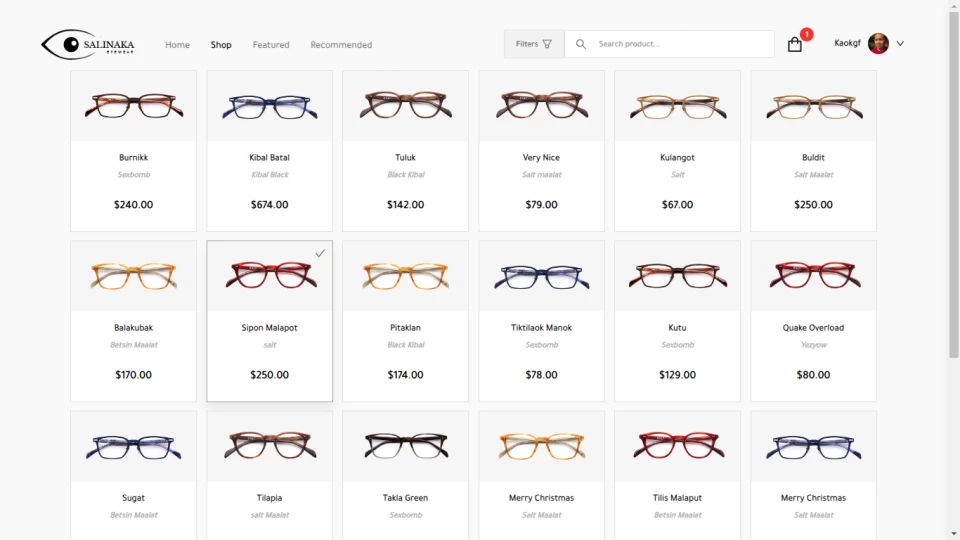

# React Basic Projects

This repository contains **5 React projects** designed to help you practice basic React concepts **without using state**. Each project comes with an image reference to guide you in replicating the design and layout exactly as shown.

---

## Project 1: Calculator



### **Instructions:**
Your task is to recreate the design exactly as shown in the image above.

### **Folder Structure:**
```
calculator/
├── index.html   # Entry HTML
├── index.css    # Entry CSS
└── index.js     # Entry JavaScript
```

### **What You Should Do:**
1. **HTML (index.html):**  
   - Set up the root `<div id="root"></div>` for React to mount.
   - Link the CSS file.

2. **CSS (index.css):**  
   - Apply styles to match the image exactly (fonts, colors, spacing, alignment).
   - Use Flexbox or Grid for layouts if needed.

3. **JavaScript (index.js):**  
   - Create functional components.
   - Use props to pass static data.
   - Render the components inside `ReactDOM.render()`.

### **Constraints:**
- **Do NOT use state or hooks.**
- Hardcode all data directly in components or props.
- Ensure the layout matches pixel-perfect to the provided image.

---

## Project 2: Weather



### **Instructions:**
Recreate the design exactly as shown.

### **Folder Structure:**
```
weather/
├── index.html
├── index.css
└── index.js
```

### **Tasks:**
- Structure the HTML with semantic tags.
- Style using external CSS.
- Use React functional components and props.

**Rules:** No state, no dynamic data fetching.

---

## Project 3: Chat App



### **Instructions:**
Replicate the design pixel-by-pixel.

### **Folder Structure:**
```
chat-app/
├── index.html
├── index.css
└── index.js
```

### **Key Points:**
- Use reusable React components.
- Apply CSS for styling.
- Hardcode any content directly in the components.

---

## Project 4: Calendar



### **Instructions:**
Match the design exactly as shown in the image.

### **Folder Structure:**
```
calendar/
├── index.html
├── index.css
└── index.js
```

### **Guidelines:**
- Use Flexbox/Grid for layouts.
- Add proper spacing, padding, and alignment.

---

## Project 5: Products App



### **Instructions:**
Recreate the project as shown in the screenshot.

### **Folder Structure:**
```
product-app/
├── index.html
├── index.css
└── index.js
```

### **Checklist:**
- Use functional components only.
- Apply external CSS styling.
- Ensure your project matches the design 100%.

---

## 🚀 Final Notes:
- Keep your code clean and well-organized.
- Use meaningful class names for CSS.
- Test your project on different screen sizes to ensure responsiveness (if applicable).

Happy Coding! 🎉
