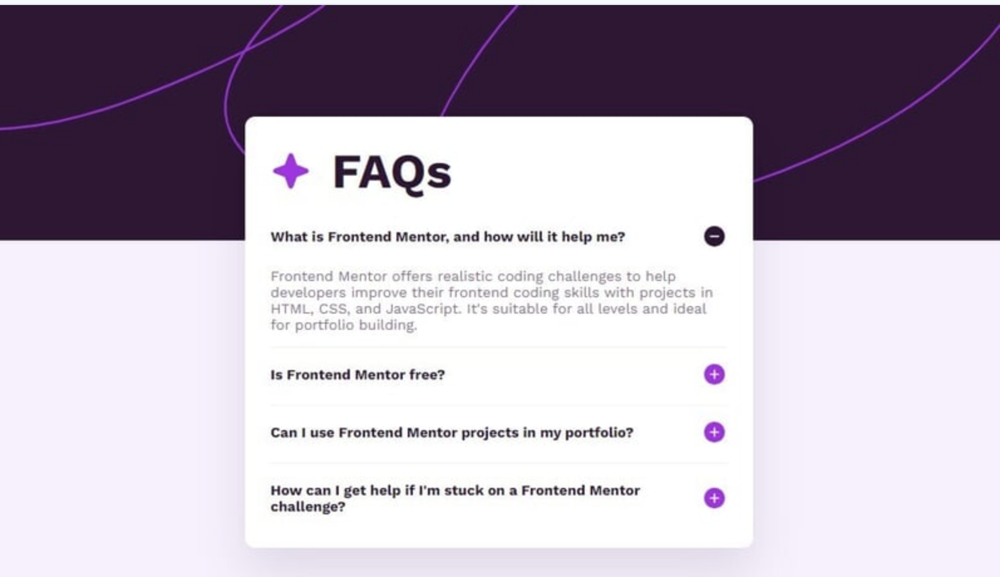

# Accordion Page

This is a simple React project to help you practice front-end development by **cloning a real-world website**.

## 🔧 Getting Started

Make sure you have **Node.js** and **npm** installed.

1. **Clone the repository:**

```bash
git clone <YOUR_REPO_LINK_HERE>
cd <project-folder>
npm install
```

2. **Start the development server:**

```bash
npm start
```

Then open [http://localhost:3000](http://localhost:3000) in your browser to see your project.

## 🧠 Objective

You're going to **clone this website**:  


Recreate the layout, styles, and responsiveness as closely as possible using **React**.

---

## 📂 Accordion Component Instructions

> The first part of this website clone includes creating an **Accordion component**. Follow these rules carefully:

1. **Clone the design exactly** as shown in the reference image.
2. **Only one accordion section should be open at a time**. When a user clicks the **plus button**, the clicked section should expand and the previously open one should close.
3. **Apply smooth transitions and animations** when showing or hiding content to improve user experience.

👉 Use the provided `accordion-data.json` in `data` folder for your content.

---

## 🎨 Tools to Help You

### 🎯 Color Picker

Use this to detect any color from the website image or screenshot:  
👉 [https://imagecolorpicker.com/](https://imagecolorpicker.com/)

### 🧩 Icons

Use [**React Icons**](https://react-icons.github.io/react-icons/) for adding icons easily.

Install with:

```bash
npm install react-icons
```

Then import like this:

```js
import { FaCoffee } from "react-icons/fa";

<FaCoffee />;
```

## 🚀 Available Scripts

```bash
npm start        # Runs the app in development mode
npm run build    # Builds the app for production
npm test         # Launches the test runner
```

---
