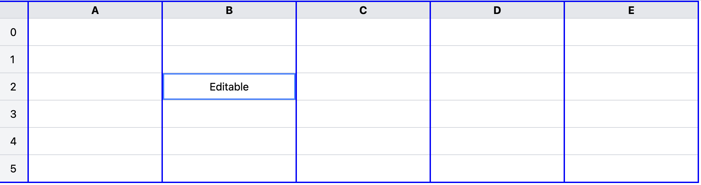

# Editable Table Application

This is a simple React project to help you practice front-end development by **cloning a real-world website**.

## 🔧 Getting Started

Make sure you have **Node.js** and **npm** installed.

1. **Clone the repository:**

```bash
git clone <YOUR_REPO_LINK_HERE>
cd <project-folder>
npm install
```

2. **Start the development server:**

```bash
npm start
```

Then open [http://localhost:3000](http://localhost:3000) in your browser to see your project.

## 🧠 Objective

You're going to **clone this website**:  


Recreate the layout, styles, and responsiveness as closely as possible using **React**.

---

Ah perfect — thanks for clarifying! Here's a clean and focused **instruction block** for your **editable table assignment**, assuming students will be building the real UI in a table format.

---

## 🧑‍💻 Editable Table Instructions

Your task is to build an **editable table** where users can modify fields directly in the UI.

### 📋 Behavior Requirements

1. **Non-Editable Column**

   - The **`ID` column is not editable**. It should always be read-only.

2. **Editable on Double Click**

   - When a user **double-clicks** on a cell:
     - If it's `name` or `email`, replace it with a **text input**.
     - If it's `role` or `status`, replace it with a **select dropdown**.

3. **Blur to Save**

   - When the input or select **loses focus (onBlur)**:
     - The edited value should be **saved to state**.
     - The cell should go back to **display mode**.

4. **Only One Editable Cell at a Time**
   - Don't allow multiple cells to be edited at once.
   - Track the currently edited cell using **row + column key**.

---

### 🧠 Dropdown Options

- **Role**: `"Admin"`, `"Editor"`, `"Viewer"`
- **Status**: `"Active"`, `"Inactive"`, `"Pending"`, `"Suspended"`

---

Let me know if you want a checklist version or want to break this into tasks for them!

Let me know if you'd like a demo of one field (like just `name`) to show them how to get started!

## 🎨 Tools to Help You

### 🎯 Color Picker

Use this to detect any color from the website image or screenshot:  
👉 [https://imagecolorpicker.com/](https://imagecolorpicker.com/)

### 🧩 Icons

Use [**React Icons**](https://react-icons.github.io/react-icons/) for adding icons easily.

Install with:

```bash
npm install react-icons
```

Then import like this:

```js
import { FaCoffee } from "react-icons/fa";

<FaCoffee />;
```

## 🚀 Available Scripts

```bash
npm start        # Runs the app in development mode
npm run build    # Builds the app for production
npm test         # Launches the test runner
```

---
