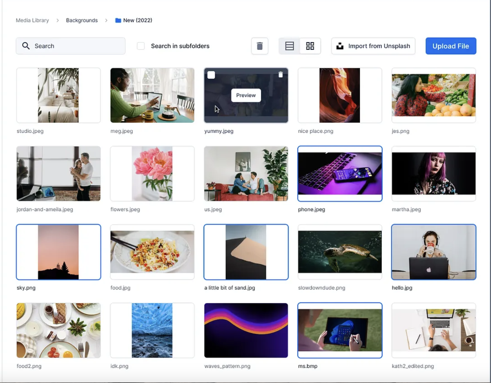

# Gallery Application

This is a simple React project to help you practice front-end development by **cloning a real-world website**.

## 🔧 Getting Started

Make sure you have **Node.js** and **npm** installed.

1. **Clone the repository:**

```bash
git clone <YOUR_REPO_LINK_HERE>
cd <project-folder>
npm install
```

2. **Start the development server:**

```bash
npm start
```

Then open [http://localhost:3000](http://localhost:3000) in your browser to see your project.

## 🧠 Objective

You're going to **clone this website**:  


Recreate the layout, styles, and responsiveness as closely as possible using **React**.
Here’s a basic set of **README instructions** for your **Image Gallery App**, based on the screenshot you shared:

---

# 🖼️ Image Gallery App

This is a simple and user-friendly **Image Gallery App** for uploading, viewing, and organizing images.

## 🚀 Features

- 📂 View images in a **grid or list layout**
- 🔍 **Search** images by name, description, tags
- 📸 **Upload** new images via file dialog
- 🌐 Import images from **The Web** by entering the URL of the image
- 🗑️ Delete selected images
- 🖱️ Double Click an **preview** an image

---

## 🧪 Examples

### Upload an Image

1. Click the **Upload File** button.
2. Select images from your computer.
3. They will appear in a modal with inputs to give description, and tags as comma spearated words, eg fun,late,night .
4. User clicks add on the model and the image is added

### Search Images

- Use the **Search bar** at the top-left to filter images by name.
- Search should do a word search in titles and description
- Optional toggle should read "Search in tags" to also add tags to the search params

### Import from Url

- Click **Import from Url**.
- A modal opens and user enters URL, Description and Title and Clicks Add.
- If Image Did not load because of wrong URL, Do not Add It

### Delete an Image

- Click an image to select it and click the **trash icon** or select multiple and click the **delete button** in the toolbar.
- Selected images will have blue borders

### Preview an Image

- Double Click an image to preview the image in a modal.
- Modal will have download buttons where user can download image

---

## 🎨 Tools to Help You

### 🎯 Color Picker

Use this to detect any color from the website image or screenshot:  
👉 [https://imagecolorpicker.com/](https://imagecolorpicker.com/)

### 🧩 Icons

Use [**React Icons**](https://react-icons.github.io/react-icons/) for adding icons easily.

Install with:

```bash
npm install react-icons
```

Then import like this:

```js
import { FaCoffee } from "react-icons/fa";

<FaCoffee />;
```

## 🚀 Available Scripts

```bash
npm start        # Runs the app in development mode
npm run build    # Builds the app for production
npm test         # Launches the test runner
```

---
